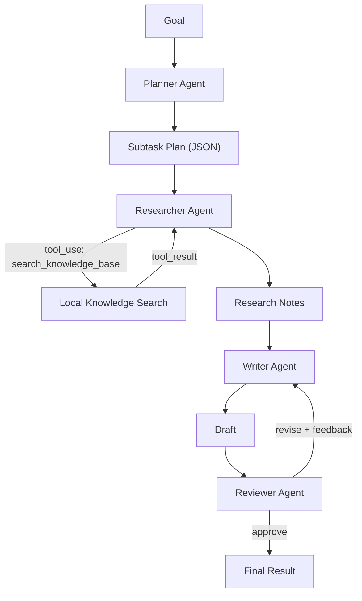

# 🤖 Agent Crew

A multi-agent task orchestrator: a **planner** agent decomposes a goal into
subtasks, a **researcher** agent gathers grounded information (using real
tool-use/function-calling), a **writer** agent drafts a report, and a
**reviewer** agent validates the result — sending it back for one revision
if it doesn't meet the bar.

Runs in **DEMO MODE with zero API keys** (every agent runs on real,
deterministic logic — not fake canned output) and switches to full
Claude-powered agents when you add an `ANTHROPIC_API_KEY`.

## Why this exists

Most "agent" portfolio projects are a single LLM call with a system prompt
that says "you are an agent." This project instead demonstrates the parts
that make a system genuinely agentic:

- **Separated agent roles** with distinct responsibilities (plan / research
  / write / review), so each agent's prompt and failure mode is simple and
  diagnosable in isolation.
- **Real tool use**: the researcher agent is given a `search_knowledge_base`
  tool via Claude's function-calling interface. Claude decides what to
  search for, the tool executes locally, and Claude summarizes the grounded
  result — a real multi-turn tool-use round trip, not a scripted call.
- **A revise loop**: the reviewer agent can send the draft back to the
  writer with specific feedback, and the writer produces a revised draft
  incorporating it (capped at 1 retry to avoid infinite loops).
- **Full tracing**: every agent's input and output is logged. In multi-agent
  systems, failures can originate at any step in the chain — without a
  trace, you can't tell whether a bad result came from bad retrieval, a bad
  plan, or a bad draft.

## Architecture



## Quick start

```bash
npm install
npm run demo -- "How should a senior engineer transition into AI roles?"
```

This runs the full pipeline in demo mode and prints a trace of every
agent's actions, followed by the final approved draft.

To run with live Claude-powered agents (including real tool use):

```bash
cp .env.example .env   # add your ANTHROPIC_API_KEY
npm start -- "Your goal here"
```

## Example run (demo mode)

```
Goal: How should a senior full-stack engineer transition into AI engineering roles?
Mode: DEMO (no API key / --demo flag)

[PLANNER] plan_result → 3-step plan: research -> draft -> review
[RESEARCHER] notes → grounded findings pulled from local knowledge base
[WRITER] draft → structured markdown report assembled from findings
[REVIEWER] verdict → { "verdict": "approve", "feedback": null }

FINAL RESULT (verdict: approve, revisions: 0)
## Report: How should a senior full-stack engineer transition into AI engineering roles?
### Key Findings
- [remote-hiring.txt] Forward Deployed Engineer roles have grown particularly
  in AI-native startups...
...
```

## Design decisions

| Decision | Reasoning |
|---|---|
| Separate planner / researcher / writer / reviewer agents | Each agent has one job and one failure mode, making the system debuggable instead of one prompt trying to do everything |
| Real tool-use for research, not a scripted call | Demonstrates the actual function-calling pattern used in production agent systems — Claude decides the query, not the orchestrator |
| Capped revise loop (max 1 retry) | Gives the reviewer real teeth without risking an infinite loop between writer and reviewer |
| Full trace logged at every step | Multi-agent failures are often silent; a trace makes it possible to find exactly where a bad result originated |
| Local knowledge base instead of live web search | Keeps the project runnable with zero external dependencies while still exercising a real retrieval + tool-use round trip |

## Limitations & next steps

- The knowledge base is a small local corpus (3 topics) for demo purposes —
  swapping in a real search API or larger vector store would make research
  genuinely open-ended.
- Only one revise loop is implemented; a production system might allow
  reviewer feedback to route back to the planner (e.g., "we need more
  research on X") rather than only to the writer.
- No persistence of past runs — adding a run log/history would help debug
  regressions in agent behavior over time.
- Demo-mode reviewer uses simple rule-based checks (headers present, length
  threshold) rather than semantic evaluation — live mode's Claude-powered
  reviewer is meaningfully stronger.

## Stack

Node.js, Claude API (`@anthropic-ai/sdk`) with function calling / tool use,
dependency-free local TF-IDF search, CLI interface.
